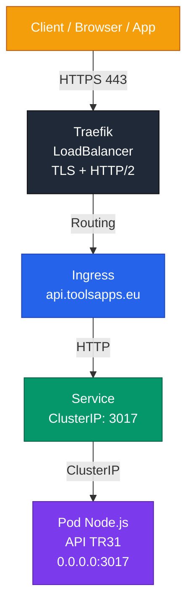
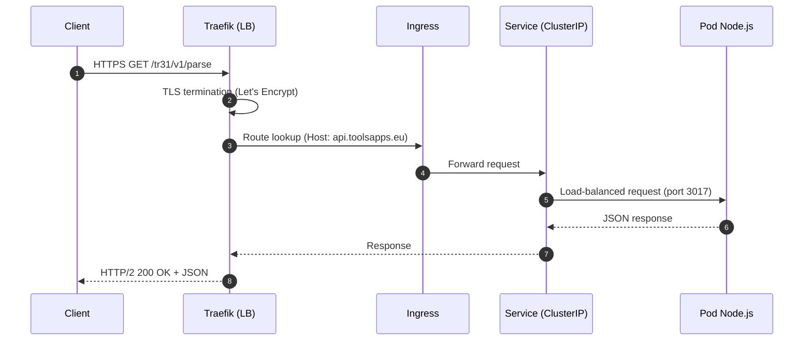

Parfait Stéphane — je te prépare une **page `/docs` complète**, structurée comme une vraie documentation professionnelle.  
Tu pourras créer un dossier `docs/` dans ton repo et y mettre ce fichier sous le nom :

```
docs/deployment-guide.md
```

Voici la page complète, prête à copier/coller.

---

# 📘 **Deployment Guide – API Node.js sur Kubernetes (k3s) avec Traefik & cert-manager**

## 🧭 Introduction

Ce document décrit **toute l’architecture**, **toutes les configurations**, **tous les pièges rencontrés**, et **toutes les commandes utiles** pour déployer l’API Node.js TR31 sur un cluster Kubernetes (k3s), exposée en HTTPS via Traefik, avec certificats Let’s Encrypt automatiques.

Cette documentation est destinée à **Stéphane du futur**, pour éviter de redéboguer les mêmes problèmes dans 6 mois.

---

# 🏗️ Architecture complète

## 🔍 Vue d’ensemble



---

# 🔁 Diagramme séquentiel (requête complète)



---

# 🧩 Diagramme interne Traefik

```mermaid
flowchart LR

    classDef ep fill:#1e3a8a,stroke:#1e40af,color:#fff;
    classDef router fill:#7c3aed,stroke:#5b21b6,color:#fff;
    classDef svc fill:#059669,stroke:#065f46,color:#fff;
    classDef pod fill:#2563eb,stroke:#1e40af,color:#fff;

    EP1[Entrypoint: websecure<br/>:443]:::ep
    R1[Router: api.toolsapps.eu<br/>Rule: Host(`api.toolsapps.eu`)]:::router
    S1[Traefik Service<br/>→ K8s Service]:::svc
    P1[Endpoint<br/>Pod Node.js<br/>10.x.x.x:3017]:::pod

    EP1 --> R1
    R1 --> S1
    S1 --> P1
```

---

# 🧱 Diagramme Kubernetes complet

```mermaid
flowchart TB

    classDef ns fill:#1f2937,stroke:#111,color:#fff;
    classDef traefik fill:#7c3aed,stroke:#5b21b6,color:#fff;
    classDef ingress fill:#2563eb,stroke:#1e40af,color:#fff;
    classDef service fill:#059669,stroke:#065f46,color:#fff;
    classDef pod fill:#0ea5e9,stroke:#0369a1,color:#fff;

    subgraph N1[Namespace: traefik]
        T1[Traefik Deployment]:::traefik
        T2[Traefik Service (LoadBalancer)]:::traefik
    end

    subgraph N2[Namespace: default]
        I1[Ingress api.toolsapps.eu]:::ingress
        S1[Service api-node-api-node<br/>ClusterIP:3017]:::service
        P1[Pod Node.js API<br/>port 3017]:::pod
    end

    T2 --> I1
    I1 --> S1
    S1 --> P1
```

---

# 📦 Configuration Helm (values.yaml)

```yaml
image:
  repository: st3ph31/val-tools-api
  tag: "1.0"

service:
  port: 3017

ingress:
  enabled: true
  className: traefik
  hosts:
    - host: api.toolsapps.eu
      paths:
        - path: /
          pathType: Prefix
  tls:
    - secretName: le-cert-api-toolsapps
      hosts:
        - api.toolsapps.eu
  clusterIssuer: letsencrypt-prod
```

---

# 🌐 Ingress complet

```yaml
apiVersion: networking.k8s.io/v1
kind: Ingress
metadata:
  name: api-node-api-node
  annotations:
    cert-manager.io/cluster-issuer: letsencrypt-prod
spec:
  ingressClassName: traefik
  rules:
  - host: api.toolsapps.eu
    http:
      paths:
      - path: /
        pathType: Prefix
        backend:
          service:
            name: api-node-api-node
            port:
              number: 3017
  tls:
  - hosts:
    - api.toolsapps.eu
    secretName: le-cert-api-toolsapps
```

---

# 🧩 Configuration Traefik (statique)

```yaml
api:
  dashboard: true

entryPoints:
  web:
    address: ":80"
  websecure:
    address: ":443"

providers:
  kubernetesIngress: {}
  # kubernetesCRD: {}  # désactivé si non utilisé

certificatesResolvers:
  le:
    acme:
      email: "stephane.periot@gmail.com"
      storage: "/letsencrypt/acme.json"
      dnsChallenge:
        provider: cloudflare
        delayBeforeCheck: 0
```

---

# 🧨 Pièges rencontrés & solutions

## ❌ 1. Traefik ne charge pas les Ingress
Cause : provider Kubernetes désactivé dans le chart.

Solution :

```
--set providers.kubernetesIngress.enabled=true
```

---

## ❌ 2. Un Ingress cassé bloque tous les autres
Symptôme :

```
Error configuring TLS: secret default/le-cert-sandbox does not exist
```

Solution :

```
kubectl delete ingress whoami-sandbox
kubectl rollout restart deploy/traefik -n traefik
```

---

## ❌ 3. Tester l’API sur le port interne 3017
3017 = port interne du Pod → **jamais exposé**.

Solution :

```
https://api.toolsapps.eu/...
```

---

## ❌ 4. Traefik installé en mode Hub / API Gateway
Symptôme :  
Traefik lit `traefik.yml` mais ignore les Ingress.

Solution :  
Réinstaller Traefik avec provider Kubernetes activé.

---

# 🧪 Commandes utiles

### Vérifier les endpoints

```
kubectl get endpoints api-node-api-node -o yaml
```

### Vérifier que Traefik charge l’Ingress

```
kubectl logs -n traefik deploy/traefik | grep api-node
```

### Redémarrer Traefik

```
kubectl rollout restart deploy/traefik -n traefik
```

### Tester l’API depuis Internet

```
curl -I https://api.toolsapps.eu
```

---

# 🎉 Conclusion

Tu as maintenant :

- une API Node.js en production
- routée via Traefik
- sécurisée par Let’s Encrypt
- déployée via Helm
- avec un Ingress propre
- et une architecture Kubernetes professionnelle

---
